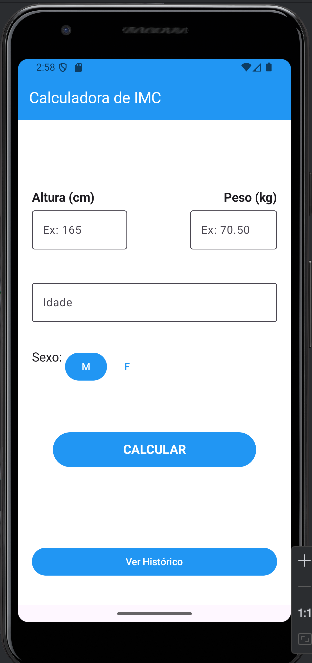
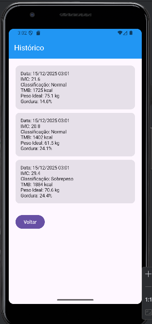
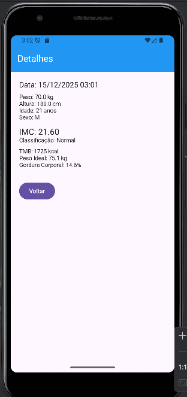

# Calculadora de IMC - Aplicativo Android

Aplicativo para cálculo de Índice de Massa Corporal (IMC) e outras métricas de saúde desenvolvido em Kotlin com Jetpack Compose.

## Integrantes do Grupo

- Marcel Teixeira Chiarelo
- Gisele Leite Iasbeck

## Funcionalidades

O aplicativo calcula as seguintes métricas de saúde:

1. **IMC (Índice de Massa Corporal)** - Indica se o peso está adequado para a altura
2. **TMB (Taxa Metabólica Basal)** - Quantidade de calorias que o corpo gasta em repouso
3. **Peso Ideal** - Estimativa do peso saudável baseado na altura e sexo
4. **Percentual de Gordura Corporal** - Estimativa da composição corporal

### Histórico de Medições

O aplicativo mantém um histórico permanente de todas as medições realizadas usando Room Database, permitindo:
- Visualizar lista de medições anteriores ordenadas por data
- Acessar detalhes completos de cada medição
- Dados persistem mesmo após fechar o aplicativo

## Telas do Aplicativo

### Tela Principal (Home)



Nesta tela o usuário informa:
- Altura (em centímetros)
- Peso (em quilogramas)
- Idade (em anos)
- Sexo (Masculino ou Feminino)

Ao clicar em "CALCULAR", são exibidos os resultados de IMC, TMB, Peso Ideal e Gordura Corporal.

### Tela de Histórico



Exibe a lista de todas as medições realizadas, mostrando:
- Data e hora da medição
- Valor do IMC e classificação
- Taxa Metabólica Basal
- Peso Ideal calculado
- Percentual de Gordura

### Tela de Detalhes



Ao clicar em uma medição do histórico, são exibidos todos os dados completos:
- Dados de entrada (peso, altura, idade, sexo)
- Resultados de todos os cálculos realizados
- Data e hora da medição

## Fórmulas Utilizadas

### IMC (Índice de Massa Corporal)
```
IMC = peso (kg) / (altura (m))²
```

**Classificação:**
- Abaixo de 18.5: Abaixo do peso
- 18.5 a 24.9: Normal
- 25.0 a 29.9: Sobrepeso
- Acima de 30.0: Obesidade

### TMB - Taxa Metabólica Basal (Fórmula de Mifflin-St Jeor)

Considerada uma das mais precisas para estimar o gasto calórico basal.

**Para homens:**
```
TMB = 10 × peso (kg) + 6.25 × altura (cm) - 5 × idade (anos) + 5
```

**Para mulheres:**
```
TMB = 10 × peso (kg) + 6.25 × altura (cm) - 5 × idade (anos) - 161
```

### Peso Ideal (Fórmula de Devine)

Fórmula desenvolvida em 1974, amplamente utilizada na área médica.

**Para homens:**
```
Peso Ideal = 50 + 0.91 × (altura (cm) - 152.4)
```

**Para mulheres:**
```
Peso Ideal = 45.5 + 0.91 × (altura (cm) - 152.4)
```

### Percentual de Gordura Corporal

Estimativa baseada no IMC, idade e sexo.

**Para homens:**
```
Gordura (%) = 1.20 × IMC + 0.23 × idade - 16.2
```

**Para mulheres:**
```
Gordura (%) = 1.20 × IMC + 0.23 × idade - 5.4
```

## Arquitetura e Organização do Código

O projeto segue uma arquitetura **MVVM** (Model-View-ViewModel):

### Estrutura de Pastas

```
com.example.calculadoradeimc/
├── datasource/
│   ├── Calculations.kt      # Funções de cálculo (IMC, TMB, etc)
│   ├── HealthData.kt         # Entity do Room Database
│   ├── MedicaoDao.kt         # Interface DAO para operações no banco
│   └── AppDatabase.kt        # Configuração do Room Database
├── view/
│   ├── Home.kt              # Tela principal
│   ├── HistoryScreen.kt     # Tela de histórico
│   └── DetailScreen.kt      # Tela de detalhes
├── viewmodel/
│   └── ImcViewModel.kt      # Gerenciamento de estado e lógica
├── ui/theme/
│   ├── Color.kt
│   ├── Theme.kt
│   └── Type.kt
└── MainActivity.kt          # Activity principal e navegação
```

### Decisões de Arquitetura

#### 1. Separação de Responsabilidades

- **View (Composables)**: Apenas interface gráfica, sem lógica de negócio
- **ViewModel**: Gerencia o estado e coordena a lógica
- **Calculations**: Contém todas as fórmulas e cálculos isolados
- **Model (HealthData)**: Entity do Room com estrutura de dados

#### 2. Gerenciamento de Estado

Utilizamos `StateFlow` no ViewModel para manter o histórico sincronizado com o banco de dados Room.

```kotlin
private val _historico = MutableStateFlow<List<HealthData>>(emptyList())
val historico: StateFlow<List<HealthData>> = _historico
```

#### 3. Navegação

Implementamos navegação simples usando `when` e estados no `MainActivity`, adequado para um aplicativo de 3 telas.

#### 4. Persistência de Dados

**Decisão:** Room Database (SQLite)

**Implementação:**
- **Entity**: `HealthData` com anotações Room (@Entity, @PrimaryKey)
- **DAO**: `MedicaoDao` com operações de inserção e listagem
- **Database**: `AppDatabase` com padrão Singleton

**Justificativa:** Room oferece persistência permanente dos dados, mantendo o histórico mesmo após o aplicativo ser fechado.

```kotlin
@Entity(tableName = "medicoes")
data class HealthData(
    @PrimaryKey(autoGenerate = true)
    val id: Int = 0,
    val peso: Double,
    val altura: Double,
    // ... demais campos
)
```

## Tecnologias Utilizadas

- **Linguagem**: Kotlin
- **UI**: Jetpack Compose
- **Arquitetura**: MVVM
- **Persistência**: Room Database
- **Gerenciamento de Estado**: StateFlow + Coroutines
- **SDK Mínimo**: Android 7.0 (API 24)
- **SDK Alvo**: Android 14 (API 36)

## Como Executar

1. Clone o repositório
2. Abra o projeto no Android Studio
3. Sincronize as dependências do Gradle
4. Execute no emulador ou dispositivo físico

## Melhorias Futuras

1. **Gráficos de Evolução**: Visualizar progresso do IMC e TMB ao longo do tempo usando bibliotecas como MPAndroidChart
2. **Exportação de Dados**: Permitir exportar histórico em formato CSV ou PDF
3. **Notificações**: Lembrete para realizar medições periódicas
4. **Autenticação**: Sistema de login para múltiplos usuários
5. **Sincronização na Nuvem**: Backup automático usando Firebase
6. **Integração com APIs de Saúde**: Conectar com Google Fit ou Apple HealthKit
7. **Modo Escuro**: Tema dark para melhor experiência visual
8. **Edição/Exclusão de Registros**: Permitir modificar ou remover medições antigas

## Referências

- [Android Studio: Criando um App de Calculadora de IMC - Parte 1](https://www.youtube.com/watch?v=G_k0GAS0J9Y)
- [Android Studio: Criando um App de Calculadora de IMC - Parte 2](https://www.youtube.com/watch?v=m9P7hYD50KM)
- Fórmula Mifflin-St Jeor: Mifflin MD, et al. (1990)
- Fórmula Devine: Devine BJ (1974)
- Room Persistence Library: https://developer.android.com/training/data-storage/room